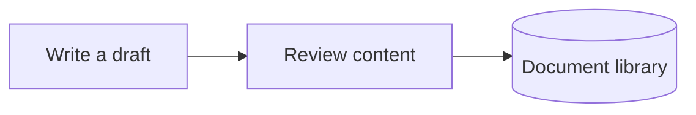

# Mermaid Viewer

**English** · [简体中文](README.zh-CN.md)

## Introduction

Mermaid Viewer makes diagrams easier to read in Obsidian. Open a diagram on a spacious fullscreen canvas, zoom into the details, and move around without losing your place in the note.

A warm, light surface keeps diagrams readable in both light and dark vaults. Text stays stable while zooming, and the original note remains unchanged.

## Screenshots

### Inline diagrams

A light diagram card with a compact header and a fullscreen action.


### Fullscreen flowcharts

View the whole process, then zoom and pan to inspect individual steps.


### Fullscreen sequence diagrams

Read interactions on a larger canvas, with thin lifelines and controls for fitting the diagram to the available space.


The previews use fictional document workflows and contain no personal notes.

## Features

- **Fullscreen viewing** — give large diagrams more room than the note column allows.
- **Stable vector zoom** — enlarge details without making labels jump or reflow.
- **Flexible navigation** — pan with dragging, the wheel or arrow keys; zoom with the wheel modifier, buttons or pinch gestures.
- **Three view modes** — fit the whole diagram, fit to width, or use the original size.
- **Consistent light canvas** — keep diagrams readable even in a dark vault.
- **Clean inline controls** — open fullscreen from the header; keep Obsidian's source-edit action in Live Preview.
- **Configurable scope** — apply to all notes or only notes carrying a chosen CSS class.
- **Semantic colors** — distinguish important nodes, steps, storage, branches, external systems and errors.
- **Local viewing** — no network requests, telemetry or changes to note content.

## Usage

### 1. Install and enable

For a manual installation, copy `main.js`, `manifest.json` and `styles.css` from the plugin package into:

```text
<your-vault>/.obsidian/plugins/mermaid-viewer/
```

Reload Obsidian, then enable **Mermaid Viewer** in **Settings → Community plugins**.

### 2. Open a diagram

Add a Mermaid code block to a note. For example:

````markdown

````

Render the note in Reading view or Live Preview, then click **全屏查看** in the diagram header. You can also use the **Mermaid Viewer: 全屏查看当前笔记的 Mermaid 图** command from Obsidian's command palette.

The interface currently uses Chinese labels. The main view buttons are **完整显示** (Fit all), **适合宽度** (Fit width), and **原始尺寸** (Original size).

### 3. Navigate

| Action                              | Result                            |
| ----------------------------------- | --------------------------------- |
| Wheel, drag, arrow keys             | Pan                               |
| Shift + wheel                       | Pan horizontally                  |
| Ctrl / ⌘ + wheel                    | Zoom around the pointer           |
| Pinch gesture                       | Zoom around the gesture           |
| Double-click / Shift + double-click | Zoom in / out                     |
| `+` / `−`                           | Zoom around the center            |
| `F` / `0`                           | Fit the whole diagram             |
| `W`                                 | Fit to width                      |
| `1`                                 | Original size                     |
| `Esc`                               | Close help first, then the viewer |

Use **适合宽度** for a long diagram, then scroll vertically to read it. Open **操作说明** in the top-right corner for controls and the color legend.

### 4. Choose which notes to include

Open **Settings → Mermaid Viewer → 图表应用范围**.

- Leave the field empty to include all notes.
- Enter one class name, such as `mermaid-notes`, to include only notes with that class. Omit the leading dot.

Add the corresponding property at the top of each selected note:

```yaml
---
cssclasses:
  - mermaid-notes
---
```

The scope updates when you leave the setting field. Disabling the plugin removes the controls and styles it added.

### 5. Add semantic colors

In flowcharts, append `:::className` to a node, as shown in the example above:

| Class    | Meaning                   |
| -------- | ------------------------- |
| `focus`  | Important node            |
| `step`   | Processing step           |
| `store`  | Data storage              |
| `branch` | Branch or supporting node |
| `ext`    | External system           |
| `err`    | Error or exception        |

Nodes without a recognized class use neutral colors. Flowcharts and sequence diagrams have the broadest support; styling for other diagram types may vary.
