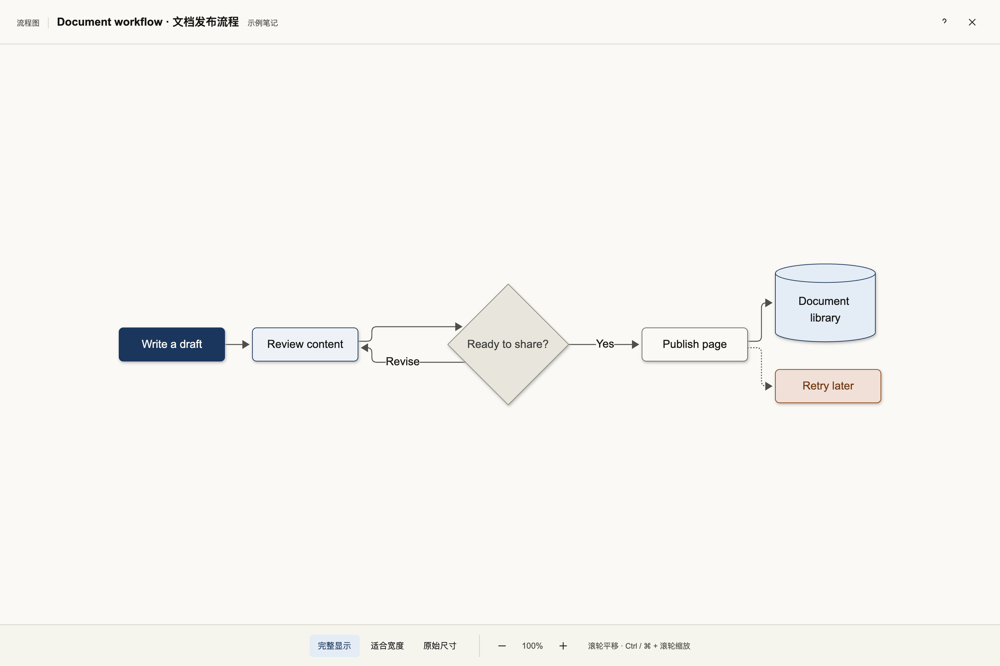
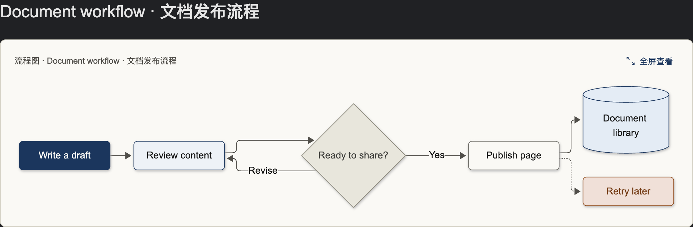
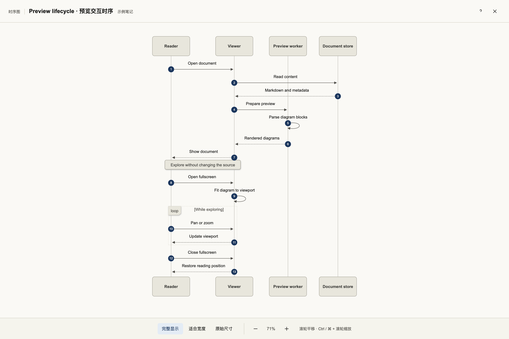
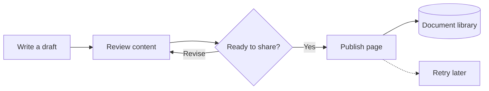

# Mermaid Paper Viewer

A calm, light canvas for Mermaid diagrams in Obsidian — fullscreen viewing, stable vector zoom, panning, and a configurable note scope.

为 Obsidian 中的 Mermaid 图表提供清晰的浅色画布，支持全屏查看、稳定的矢量缩放、拖动和自定义笔记范围。

[English](#english) · [简体中文](#简体中文)



## English

### Features

- A consistent light surface, even when the vault uses a dark theme.
- Stable zoom without text reflow, plus mouse, keyboard, wheel and pinch controls.
- Fit the whole diagram, fit its width, or view it at its original size.
- Clean inline cards with a fullscreen action and the native source-edit control in Live Preview.
- Apply to all notes, or restrict the plugin to one `cssclasses` value.
- Optional semantic node colors through `focus`, `step`, `store`, `branch`, `ext` and `err` classes. Unclassified nodes use neutral colors.
- No network requests, telemetry, account requirement or note-content changes.

The interface currently uses Chinese labels. Fullscreen controls also have keyboard shortcuts listed below.

### Examples

All screenshots use original, fictional document workflows. They are rendered from the sources in [docs/examples](docs/examples) with a browser harness, not captured from a personal vault.





Try this in a Mermaid code block:



### Install locally

This project has not been submitted to the community directory yet.

1. Install Node.js 22.13 or newer, then run `npm ci` and `npm run build`.
2. Copy `main.js`, `manifest.json` and `styles.css` from `dist/` to `<vault>/.obsidian/plugins/mermaid-paper-viewer/`.
3. Reload Obsidian and enable **Mermaid Paper Viewer** under Community plugins.

For development, the installer below copies the build, backs up existing plugin files and preserves `data.json`:

```bash
npm run build
npm run install:local -- /absolute/path/to/vault
```

If the vault uses a custom configuration directory, pass its directory name as the second argument. The installer does not enable or reload the plugin automatically.

### Configure the note scope

Under **Mermaid Paper Viewer → 图表应用范围**, leave the value empty to apply to all notes. To select specific notes, enter `mermaid-notes` and add this property to those notes:

```yaml
---
cssclasses:
  - mermaid-notes
---
```

Use one class name without a leading dot. Scope changes take effect after the setting loses focus. Disabling the plugin removes its injected controls and styles.

### Controls

| Action                              | Result                             |
| ----------------------------------- | ---------------------------------- |
| Wheel, drag, arrow keys             | Pan the diagram                    |
| Shift + wheel                       | Pan horizontally                   |
| Ctrl / ⌘ + wheel, pinch             | Zoom around the pointer or gesture |
| Double-click / Shift + double-click | Zoom in / out                      |
| `+` / `−`                           | Zoom around the center             |
| `F` / `0`                           | Fit the whole diagram              |
| `W`                                 | Fit to width                       |
| `1`                                 | Original size                      |
| `Esc`                               | Close help first, then the viewer  |

### Develop

```bash
npm ci
npx puppeteer browsers install chrome
npm run check
npm run dev
```

| Command                        | Purpose                                                            |
| ------------------------------ | ------------------------------------------------------------------ |
| `npm run build`                | Type-check and build installation files in `dist/`                 |
| `npm run dev`                  | Watch source modules and package assets                            |
| `npm run check`                | Lint, formatting, build, unit/browser tests and package checks     |
| `npm run format`               | Format source, tests and documentation                             |
| `npm run docs:images`          | Regenerate example SVGs and README screenshots after building      |
| `npm run version:set -- 1.5.0` | Synchronize package, manifest, lockfile and compatibility versions |
| `npm run release:check`        | Check public-release metadata and license prerequisites            |

Edit `src/` and `styles.css`; `dist/` is generated. Mermaid and Chromium are development tools only and are not bundled with the installed plugin. Image generation and browser tests never read a vault.

### Compatibility and release status

Flowcharts and sequence diagrams have automated geometry, interaction and contrast coverage. Other Mermaid types retain their original internal styling where possible and have not all been validated. Desktop integration has been checked in Obsidian 1.13.7. The declared minimum version and mobile support still need dedicated testing; narrow-browser tests do not replace device testing. Pop-out windows are not currently covered.

The project is not yet publicly released. Public author/repository metadata and a license must be chosen before publication. `UNLICENSED` is intentional until then. See [architecture](docs/ARCHITECTURE.md), [publishing steps](docs/PUBLISHING.md) and [changelog](CHANGELOG.md).

## 简体中文

### 功能

- 图表固定使用浅色画布，在深色主题中同样保持清晰。
- 缩放时不重新排版文字，支持拖动、滚轮、键盘和双指捏合。
- 提供完整显示、适合宽度、原始尺寸三种视图。
- 实时预览中使用简洁卡片，将全屏按钮与原生源码编辑入口对齐。
- 可以应用到所有笔记，也可以只处理指定 `cssclasses` 的笔记。
- 通过 `focus`、`step`、`store`、`branch`、`ext`、`err` 通用节点类设置语义配色；未分类节点使用中性色。
- 不修改笔记正文，不发送网络请求，没有遥测或账号要求。

上面的示例图片全部来自 [原创通用示例](docs/examples)，使用浏览器预览环境生成，没有读取或截取个人 Vault。当前插件界面使用中文。

### 本地安装

项目尚未提交 Obsidian 社区插件目录。

1. 安装 Node.js 22.13 或更新版本，运行 `npm ci`、`npm run build`。
2. 将 `dist/` 中的 `main.js`、`manifest.json`、`styles.css` 复制到 `<Vault>/.obsidian/plugins/mermaid-paper-viewer/`。
3. 重启或重载 Obsidian，在第三方插件中启用 **Mermaid Paper Viewer**。

也可以运行：

```bash
npm run build
npm run install:local -- /absolute/path/to/vault
```

自定义配置目录可作为第二个参数传入。安装脚本会备份已有插件文件并保留 `data.json`，不会自动启用或重载插件。

### 使用与范围设置

点击图表上方的“全屏查看”即可进入查看器。

在 **Mermaid Paper Viewer → 图表应用范围** 中，留空表示所有笔记。填写 `mermaid-notes` 则仅处理具有该 `cssclasses` 的笔记，属性格式见上方示例。只能填写一个类名，不加点号；输入框失去焦点后生效。停用插件会清理添加的控件和样式。

| 操作                      | 效果                     |
| ------------------------- | ------------------------ |
| 滚轮、拖动、方向键        | 平移图表                 |
| Shift + 滚轮              | 水平平移                 |
| Ctrl / ⌘ + 滚轮、双指捏合 | 围绕指针或手势位置缩放   |
| 双击 / Shift + 双击       | 放大 / 缩小              |
| `+` / `−`                 | 围绕画布中心缩放         |
| `F` / `0`                 | 完整显示                 |
| `W`                       | 适合宽度                 |
| `1`                       | 原始尺寸                 |
| `Esc`                     | 先收起帮助，再关闭查看器 |

### 开发与维护

运行 `npm ci` 安装锁定依赖，运行 `npx puppeteer browsers install chrome` 安装测试浏览器，再运行 `npm run check` 完成全部检查。`npm run dev` 监听源码变化，`npm run docs:images` 在构建后重新生成示例图和测试 SVG。

维护入口是 `src/` 与 `styles.css`；不要直接编辑 `dist/`。Mermaid 和 Chromium 仅用于开发测试，不进入插件安装包；截图脚本不访问 Vault。

流程图和时序图已有自动化验证，其他图种尚未逐类验收。已在 Obsidian 1.13.7 桌面版验证集成，声明的最低版本、移动设备和分离窗口仍有待进一步验收。

公开发布前还需填写作者、仓库地址并选择许可证；当前使用 `UNLICENSED`，尚未公开发布。维护和发布细节见 [架构说明](docs/ARCHITECTURE.md)、[发布指南](docs/PUBLISHING.md) 和 [变更记录](CHANGELOG.md)。
