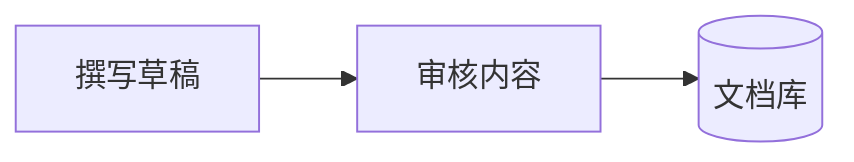

# Mermaid Viewer

[English](README.md) · **简体中文**

## 介绍

Mermaid Viewer 让 Obsidian 中的图表更容易阅读。将图表展开到宽敞的全屏画布，放大查看细节、拖动浏览，关闭后即可回到原来的笔记位置。

柔和的浅色画布在深浅主题中都保持清晰；缩放时文字稳定，不会重新排版，也不会修改笔记正文。

## 效果图

### 笔记内嵌图表

浅色图表卡片搭配简洁标题栏，点击按钮即可进入全屏。


### 流程图全屏查看

先看清完整流程，再通过缩放和拖动查看某个步骤。


### 时序图全屏查看

在更大的画布上阅读交互过程，配合细生命线和适配视图，浏览长图更加方便。


示例使用虚构的文档工作流，不包含个人笔记内容。

## 功能

- **全屏查看**：为复杂图表提供超出笔记栏宽度的阅读空间。
- **稳定的矢量缩放**：放大细节时，文字不会左右跳动或重新排版。
- **多种浏览方式**：支持拖动、滚轮、方向键、缩放按钮和双指捏合。
- **三种视图模式**：完整显示、适合宽度、原始尺寸。
- **固定浅色画布**：深色 Vault 中的图表依然清晰可读。
- **简洁的内嵌操作区**：标题栏提供全屏入口，实时预览保留 Obsidian 原生源码编辑操作。
- **可配置应用范围**：应用到所有笔记，或仅处理带有指定 CSS 类名的笔记。
- **语义配色**：区分重点节点、处理步骤、存储、分支、外部系统与异常。
- **本地查看**：不发送网络请求、没有遥测、不修改笔记正文。

## 使用方法

### 1. 安装并启用

手动安装时，将插件包中的 `main.js`、`manifest.json`、`styles.css` 放入：

```text
<你的Vault>/.obsidian/plugins/mermaid-viewer/
```

重载 Obsidian，然后在 **设置 → 第三方插件** 中启用 **Mermaid Viewer**。

### 2. 打开图表

在笔记中添加 Mermaid 代码块，例如：

````markdown

````

在阅读视图或实时预览中显示图表后，点击标题栏的 **全屏查看**。也可以从 Obsidian 命令面板运行 **Mermaid Viewer: 全屏查看当前笔记的 Mermaid 图**。

### 3. 缩放与浏览

| 操作                | 效果                     |
| ------------------- | ------------------------ |
| 滚轮、拖动、方向键  | 平移                     |
| Shift + 滚轮        | 水平平移                 |
| Ctrl / ⌘ + 滚轮     | 围绕指针缩放             |
| 双指捏合            | 围绕手势位置缩放         |
| 双击 / Shift + 双击 | 放大 / 缩小              |
| `+` / `−`           | 围绕画布中心缩放         |
| `F` / `0`           | 完整显示                 |
| `W`                 | 适合宽度                 |
| `1`                 | 原始尺寸                 |
| `Esc`               | 先收起帮助，再关闭查看器 |

长图可以先选择 **适合宽度**，再上下滚动阅读。点击右上角 **操作说明**，可以查看快捷键和颜色图例。

### 4. 设置笔记范围

打开 **设置 → Mermaid Viewer → 图表应用范围**。

- 留空表示应用到所有笔记。
- 填写 `mermaid-notes` 等单个类名，表示仅处理带有该类名的笔记；不要加点号。

在所选笔记顶部添加对应属性：

```yaml
---
cssclasses:
  - mermaid-notes
---
```

离开设置输入框后生效。停用插件会移除它添加的控件和样式。

### 5. 使用语义配色

在流程图节点后添加 `:::类名`，用法见上方示例：

| 类名     | 含义           |
| -------- | -------------- |
| `focus`  | 重点节点       |
| `step`   | 处理步骤       |
| `store`  | 数据存储       |
| `branch` | 分支或辅助节点 |
| `ext`    | 外部系统       |
| `err`    | 错误或异常     |

未指定已识别类名的节点使用中性色。流程图和时序图支持最完善，其他图种的样式效果可能有所不同。
